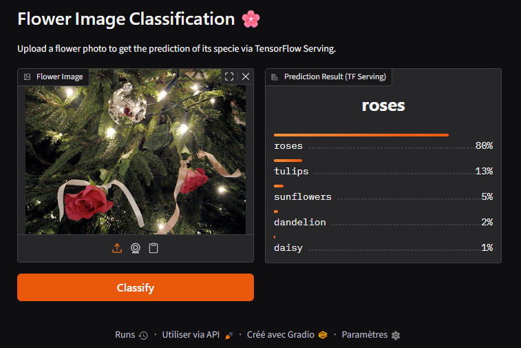

# Flower Images Classification with TensorFlow

Hello, I'm [Joseph Konka](https://www.linkedin.com/in/joseph-koami-konka/), Python enthousiast. This project showcase how to build and deploy a flower image classifier using TensorFlow, Serving and Docker.



## Setup environment

Requires Python < 3.14

### Create a virtual environment

```bash
python -m venv .venv
source .venv/Scripts/activate
pip install -r requirements.txt
```

### For windows users, install Graphviz

```powershell
winget install Graphviz.Graphviz
```

### Add Graphviz to PATH variables

```python
import os
os.environ["PATH"] += os.pathsep + r"C:\Program Files\Graphviz\bin"
```

## Launch Jupyter Lab

```bash
jupyter-lab
```

## Deploy with TFX and Docker

```bash
MSYS_NO_PATHCONV=1 docker run -d --name tf_serving_flowers \
  -p 8501:8501 \
  -v "$(pwd)/models/flower_classifier:/models/flower_classifier" \
  -e MODEL_NAME=flower_classifier \
  tensorflow/serving
```

It exposes the model on port 8501. We will use this port to test the model. REST endpoint for prediction is
[http://localhost:8501/v1/models/flower_classifier:predict](http://localhost:8501/v1/models/flower_classifier:predict)

## Testing

### Check if the model is available

```bash
$ curl http://localhost:8501/v1/models/flower_classifier
```

```json
{
  "model_version_status": [
    {
      "version": "1",
      "state": "AVAILABLE",
      "status": {
        "error_code": "OK",
        "error_message": ""
      }
    }
  ]
}
```

### Launch Gradio App

```bash
python app.py
```

Visit Gradio App at [http://localhost:7862](http://localhost:7862). Upload an image and let the magic operate !


